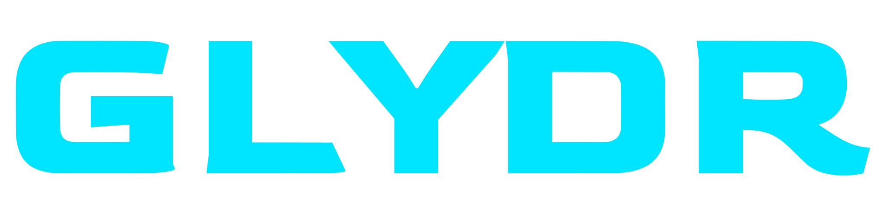

# GLYDR Website — Claude Code Baseline

## Project Overview

**Product:** GLYDR — analog dual foot controller for PC gaming and VR  
**Site:** glydr.gg (Shopify-hosted, but this build is a standalone marketing site)  
**Stack:** HTML + CSS + Vanilla JS (no framework). Shopify product embed via Buy Button JS for the product page. Deploy via Vercel.  
**Goal:** Esports/gaming aesthetic. Dark, cinematic, high-performance feel. Think Corsair meets Valorant — not RGB party, not generic SaaS.

---

## File Structure

```
/
├── index.html          # Homepage
├── product.html        # Product detail page (Shopify embed placeholder)
├── about.html          # About / team
├── blog/
│   └── index.html      # Blog index
├── assets/
│   ├── css/
│   │   └── tokens.css  # All CSS custom properties (single source of truth)
│   ├── js/
│   │   └── main.js     # Nav, scroll effects, interactions
│   ├── fonts/          # (loaded via Google Fonts — see below)
│   └── svg/
│       ├── glydr-logo-white.svg
│       ├── glydr-logo-cyan.svg
│       ├── glydr-logo-dark.svg
│       └── glydr-logo-blue.svg
└── CLAUDE.md
```

The SVG logo files already exist in `assets/svg/`. Use them — never recreate the wordmark in text or with a web font.

---

## Design Tokens

All tokens live in `assets/css/tokens.css` and are imported first in every HTML file.

### Colors

```css
:root {
  /* Backgrounds — darkest to lightest */
  --g-black:    #050608;
  --g-void:     #0C0D13;
  --g-dark:     #11121A;
  --g-surface:  #181923;
  --g-panel:    #1E2030;
  --g-border:   #2A2D3E;

  /* Text */
  --g-muted:    #3D4160;
  --g-mid:      #6B708C;
  --g-light:    #A8ADCB;
  --g-offwhite: #E8EAFF;
  --g-white:    #FFFFFF;

  /* Brand — primary */
  --g-cyan:        #00E5FF;
  --g-cyan-dim:    #00B8CC;
  --g-cyan-dark:   #006B7A;
  --g-cyan-ghost:  rgba(0, 229, 255, 0.08);

  /* Brand — accent */
  --g-volt:        #AAFF00;
  --g-volt-dim:    #88CC00;
  --g-volt-ghost:  rgba(170, 255, 0, 0.07);

  /* Brand — destructive/energy */
  --g-ember:       #FF4D1C;
  --g-ember-ghost: rgba(255, 77, 28, 0.10);

  /* Gradients */
  --g-gradient-primary: linear-gradient(135deg, #00E5FF 0%, #0077FF 100%);
  --g-gradient-accent:  linear-gradient(135deg, #AAFF00 0%, #00E5FF 100%);
  --g-gradient-ember:   linear-gradient(135deg, #FF4D1C 0%, #FF8C00 100%);

  /* Glows — use sparingly on hero elements only */
  --g-glow-cyan:  0 0 20px rgba(0,229,255,.4), 0 0 60px rgba(0,229,255,.15);
  --g-glow-volt:  0 0 20px rgba(170,255,0,.4),  0 0 60px rgba(170,255,0,.15);
  --g-glow-ember: 0 0 20px rgba(255,77,28,.4),  0 0 60px rgba(255,77,28,.15);
}
```

**Color rules:**
- `--g-cyan` is the primary CTA color (buttons, links, active states, focus rings)
- `--g-volt` is the secondary accent (watch video, secondary CTAs, success states)
- `--g-ember` is energy/urgency only (limited stock, sale, error states)
- Never use glows on body UI — hero elements and product spotlight only
- Body background is always `--g-black`. Card/panel backgrounds use `--g-surface` or `--g-panel`

### Typography

```css
:root {
  --font-display: 'Barlow Condensed', sans-serif;
  --font-body:    'Barlow', sans-serif;
  --font-mono:    'Share Tech Mono', monospace;
}
```

**Google Fonts import (in every HTML `<head>`):**
```html
<link rel="preconnect" href="https://fonts.googleapis.com">
<link href="https://fonts.googleapis.com/css2?family=Barlow+Condensed:wght@300;400;500;600;700;800;900&family=Barlow:wght@300;400;500;600;700&family=Share+Tech+Mono&display=swap" rel="stylesheet">
```

**Usage:**
- `--font-display` (Barlow Condensed): All headings, buttons, nav links, badges, section labels. Always `text-transform: uppercase`. Weight 700–900.
- `--font-body` (Barlow): All body copy, descriptions, UI text. Weight 400–500.
- `--font-mono` (Share Tech Mono): Eyebrow labels, spec data, code, prices, stats. Always `letter-spacing: 0.15em+`.

### Spacing

```css
:root {
  --sp-4: 4px;   --sp-8: 8px;   --sp-12: 12px;  --sp-16: 16px;
  --sp-24: 24px; --sp-32: 32px; --sp-48: 48px;  --sp-64: 64px;
  --sp-96: 96px; --sp-128: 128px;
}
```

### Motion

```css
:root {
  --dur-fast: 150ms;
  --dur-mid:  300ms;
  --dur-slow: 600ms;
  --ease-expo: cubic-bezier(0.16, 1, 0.3, 1);
  --ease-out:  cubic-bezier(0.0, 0.0, 0.2, 1);
  --ease-snap: cubic-bezier(0.25, 0, 0, 1);
}
```

**Motion rules:**
- Hover states: `--dur-fast` + `ease`
- Card reveals, dropdowns, button lifts: `--dur-mid` + `--ease-expo`
- Page transitions, hero reveals: `--dur-slow` + `--ease-expo`
- Only animate `transform` and `opacity` — never layout properties
- Respect `prefers-reduced-motion` on all animations

### Border Radius

```css
:root {
  --r-sm:   2px;
  --r-md:   4px;
  --r-lg:   8px;
  --r-xl:   12px;
  --r-pill: 9999px;
}
```

---

## Component Patterns

### Buttons

```html
<!-- Primary (cyan) -->
<button class="btn btn-lg btn-primary">Order Now</button>

<!-- Accent (volt) -->
<button class="btn btn-lg btn-accent">Watch Demo</button>

<!-- Ghost cyan -->
<button class="btn btn-lg btn-ghost">Join Discord</button>

<!-- Ghost neutral -->
<button class="btn btn-lg btn-outline">Downloads</button>
```

All buttons:
- Font: `--font-display`, `font-weight: 700`, `text-transform: uppercase`, `letter-spacing: 0.1em`
- Sizes: `btn-sm` (11px / 7px 14px), `btn-md` (13px / 11px 22px), `btn-lg` (15px / 14px 28px), `btn-xl` (17px / 18px 44px)
- Border radius: `--r-md`
- Hover: `translateY(-1px)` + glow on primary/accent, darken on ghost

### Navigation

The nav is transparent over the hero and transitions to `--g-void` with `backdrop-filter: blur(12px)` on scroll.

```html
<nav class="site-nav" id="site-nav">
  <a href="/" class="nav-logo">
    
  </a>
  <div class="nav-links">
    <a href="/product.html">Product</a>
    <a href="/about.html">About</a>
    <a href="/blog/">Blog</a>
    <a href="https://discord.gg/PTx5aHDvFX" target="_blank">Discord</a>
  </div>
  <div class="nav-actions">
    <button class="btn btn-sm btn-outline">Log In</button>
    <button class="btn btn-sm btn-primary">Buy $299</button>
  </div>
</nav>
```

JS scroll behavior in `main.js`:
```js
window.addEventListener('scroll', () => {
  document.getElementById('site-nav').classList.toggle('scrolled', window.scrollY > 60);
});
```

### Cards

- **Feature card:** `--g-surface` bg, `1px solid --g-border`, `--r-xl`, hover lifts `translateY(-2px)` + top border gradient appears
- **Stat card:** Large Barlow Condensed numerals in `--g-cyan` or `--g-volt`, mono label above
- **Product card:** Media area top + content below, badge overlay on media

### Badges

```html
<span class="badge badge-cyan"><span class="badge-dot"></span>Now Shipping</span>
<span class="badge badge-volt">New Feature</span>
<span class="badge badge-ember">Limited</span>
<span class="badge badge-neutral">PC Only</span>
```

Font: `--font-mono`, 9px, `letter-spacing: 0.15em`, `text-transform: uppercase`, `border-radius: --r-pill`

### Section Eyebrows

Every section starts with a mono eyebrow label:
```html
<div class="eyebrow">Foundation</div>
<h2 class="section-title">Color System</h2>
```

Eyebrow: `--font-mono`, 9px, `letter-spacing: 0.25em`, `color: --g-cyan`, with a 20px `--g-cyan` line before it via `::before` pseudo.

---

## Page Layouts

### Homepage (`index.html`)

Sections in order:

1. **Hero** — fullscreen, video background (muted autoplay loop), radial cyan glow at right, subtle grid overlay, corner bracket decorators. Logo centered or left-aligned. H1 in Barlow Condensed 900. Two CTAs: primary + ghost volt.

2. **Marquee ticker** — `--g-cyan` background, black text, `Barlow Condensed 800`, scrolling product claims. ("Now Shipping ✦ Assembled in Texas ✦ 16 Mappable Actions ✦ USB-C Wired")

3. **Problem/Solution** — two-column. Left: "Your hands are maxed out." pain point copy. Right: stat callouts (16 actions, 12ms latency, etc.)

4. **Features grid** — 4-up feature cards with icon, title, body.

5. **Product spotlight** — full-bleed dark section, product image/video left, specs right. Shopify Buy Button embedded here (or placeholder div with `id="shopify-product-embed"`).

6. **Social proof / Press** — logos or quote cards from press mentions (TNVC, Kickstarter, Disabled World, Dallas Observer).

7. **Discord / Community CTA** — dark section, cyan glow, Discord join button.

8. **Footer** — logo, nav links, social links (Discord, LinkedIn, Kickstarter), newsletter input, legal.

### Product Page (`product.html`)

- Hero with product imagery
- Tabs: Overview / Specs / Profiles / Reviews
- Shopify embed target: `<div id="shopify-product-component"></div>`
- Shopify Buy Button JS snippet goes here (placeholder until connected)

---

## Hero Video

The hero background video should autoplay, loop, muted, with `playsinline`. Fallback to a dark image if video fails.

```html
<video class="hero-video" autoplay muted loop playsinline poster="assets/img/hero-poster.jpg">
  <source src="assets/video/hero.mp4" type="video/mp4">
</video>
```

The video overlay is:
```css
.hero-overlay {
  background: linear-gradient(
    135deg,
    rgba(5, 6, 8, 0.75) 0%,
    rgba(5, 6, 8, 0.40) 50%,
    rgba(0, 229, 255, 0.05) 100%
  );
}
```

Video source URL (YouTube embed as fallback reference): `https://youtu.be/UPsQ8cUTq84`

---

## Shopify Integration

Product is sold at `https://glydr.gg/products/glydr` ($299 USD).

For the standalone site, embed via Shopify Buy Button JS:
```html
<!-- In <head> -->
<script src="https://sdks.shopifycdn.com/buy-button/latest/buy-button-storefront.min.js"></script>

<!-- In body where product should appear -->
<div id="product-component-placeholder" style="min-height:400px;display:flex;align-items:center;justify-content:center;background:var(--g-surface);border:1px solid var(--g-border);border-radius:var(--r-xl);">
  <span style="font-family:var(--font-mono);font-size:11px;letter-spacing:.15em;color:var(--g-mid);">SHOPIFY PRODUCT EMBED</span>
</div>
```

The Shopify storefront domain is `glydr.gg`. The Buy Button JS needs a `storefrontAccessToken` — use a placeholder until the client provides it.

---

## Grid System

12-column grid, CSS Grid:

```css
.container {
  width: 100%;
  max-width: 1280px;
  margin: 0 auto;
  padding: 0 var(--sp-64);
}

.grid {
  display: grid;
  grid-template-columns: repeat(12, 1fr);
  gap: var(--sp-32);
}
```

Breakpoints:
- Mobile: `< 768px` — 4 cols, 16px gutter, 16px margin
- Tablet: `768px–1024px` — 8 cols, 24px gutter, 32px margin
- Desktop: `> 1024px` — 12 cols, 32px gutter, 64px margin

---

## Logo Usage

Always use the SVG files. Never recreate in text.

```html
<!-- Default: white on dark backgrounds -->


<!-- On cyan backgrounds -->


<!-- Cyan version for special use -->

```

Minimum display width: 100px. Clear space: equal to the height of the "G" on all sides.

---

## SEO & Meta

Base meta for all pages:

```html
<meta charset="UTF-8">
<meta name="viewport" content="width=device-width, initial-scale=1.0">
<meta name="description" content="GLYDR is the world's most versatile analog foot controller for PC gaming and VR. 16 mappable actions. USB-C Wired. Assembled in Texas.">
<meta property="og:title" content="GLYDR — Analog Foot Controller for Gaming & VR">
<meta property="og:description" content="Unlock 16 new actions with your feet. GLYDR is the first analog dual foot controller built for PC gamers, VR users, and creators.">
<meta property="og:image" content="assets/img/og-image.jpg">
<meta property="og:url" content="https://glydr.gg">
<meta name="twitter:card" content="summary_large_image">
<link rel="canonical" href="https://glydr.gg">
```

---

## Key Brand Copy

Use these verbatim where appropriate:

- **Hero H1:** "Unlock Your Feet." or "Your Hands Are Maxed Out."
- **Sub-headline:** "The world's first analog dual foot controller for PC gaming and VR. 16 additional actions. Zero extra fingers required."
- **Tagline:** "Engage the agility of your feet."
- **Product descriptor:** "Fully configurable analog foot controller for video games and virtual reality. Assembled in Texas."
- **CTA primary:** "Order Now — $299"
- **CTA secondary:** "Watch Demo" or "Join Discord"
- **Ticker claims:** "Now Shipping" / "Assembled in Texas" / "16 Mappable Actions" / "USB-C Wired" / "Mac + Windows + Linux"

---

## Social / External Links

| Platform  | URL |
|-----------|-----|
| Discord   | https://discord.gg/PTx5aHDvFX |
| Kickstarter | https://www.kickstarter.com/projects/glydr/glydr-analog-dual-foot-controller-for-video-games-and-vr |
| LinkedIn  | https://www.linkedin.com/company/glydrgg/ |
| All socials | https://linktr.ee/glydrgg |
| YouTube (explainer) | https://youtu.be/c37ZFwunefE |
| YouTube (1 min) | https://youtu.be/UPsQ8cUTq84 |

---

## Do Not

- Do not use Inter, Roboto, or system fonts anywhere
- Do not use `box-shadow` drop shadows on cards — use border + background shift on hover
- Do not use purple or rainbow RGB gradients — this is a cyan/volt/ember palette
- Do not use emoji in UI — use SVG icons or CSS shapes
- Do not use `position: fixed` for modals — breaks iframe/embed contexts
- Do not hardcode colors — always reference CSS tokens
- Do not recreate the wordmark in HTML/CSS text — always use the SVG files
- Do not add marketing copy that isn't in this doc or on glydr.gg — don't invent claims
